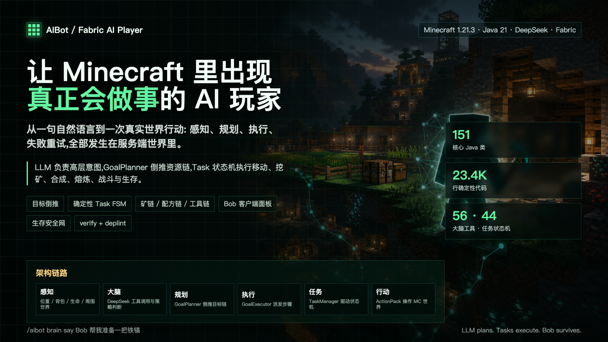
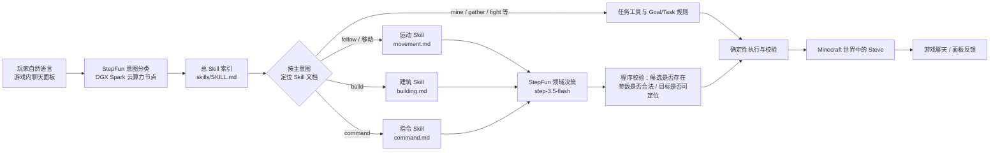

# AIBot・会理解任务的 Minecraft 智能玩家

**一句自然语言 → 云端 StepFun 分类 → 分层 Skill 文档 → StepFun 领域决策 → 游戏内确定性执行**

从「为我搭一栋日式建筑」到一座真实落成的房子，中间每一步都可检查、可追溯。


`Minecraft 1.21.3` · `Fabric` · `Java 21` · `StepFun（开源）` · `StepFun 阶跃星辰` · `Agent Skills`


***

## 项目简介

AIBot 是一个面向 Minecraft 1.21.3 的 Fabric 客户端模组。它在游戏中生成一个**真实的 AI 玩家（Steve）**，你可以用中文自然语言和它对话、让它建造、采矿、收集、战斗或跟随 —— 它在**生存模式与创造模式下都能正常工作**。

与传统「一个大模型 + 一堆工具」的方案不同，AIBot 把「理解你想做什么」和「决定具体怎么做」拆成两层模型，并用一套**分层 Skill 文档**把领域知识沉淀下来：


* **StepFun（开源模型）** 部署在 **DGX Spark 平台提供的云算力节点服务器**上，通过对外开放的推理端口调用，负责第一层快速、轻量的**意图分类**；

* 分类确定后，系统先查询一份**总 Skill 索引**，再定位到对应的**具体 Skill 文档**（运动 / 建筑 / 指令）；

* **StepFun（阶跃星辰）** 大模型在已确定的领域内，依据文档规范做第二层**行动决策**；

* 最终由 Java 代码校验结果并交给确定性的游戏逻辑执行，模型不直接改世界。

> **核心设计原则**
>
> ：模型负责理解与选择，Skill 文档负责领域规则，代码负责校验与落地。


***

## 核心亮点


* **双模型分层，各司其职**：小模型 StepFun 做毫秒级意图分类，大模型 StepFun 只在确定领域内做决策，兼顾速度、成本与准确性。

* **文档即能力（Documentation-as-Capability）**：运动、建筑、指令的规则写成 Markdown Skill，新增能力主要靠新增 / 改写文档，而不是改代码、重训模型。

* **分类 → 查文档 → 决策 → 执行** 的完整链路，每一环都有明确的输入、输出与失败条件，误路由和执行失败可被精准定位。

* **生存 / 创造双模式统一入口**：对话始终可用；建筑任务在两种模式下分别走对应的建造回路。

* **真实玩家、确定性执行**：机器人是 Fabric 生成的真实玩家，配合寻路、Goal/Task 状态机与 litematic 蓝图系统，而非脚本外挂账号。

* **只使用原版方块、容错跳过**：内置蓝图全部由原版方块构成，遇到无法放置的方块会跳过继续，不会中断整个建造。


***

## 整体架构：从对话到行动




### 一次建造请求的完整链路


```
玩家：为我搭建一个日式建筑
  │
  ├─ StepFun（DGX Spark 云节点）  → 主意图 build
  ├─ 查总 Skill 索引            → 命中「建筑 Skill」
  ├─ 读 building.md            → 规定 StepFun 只能从真实蓝图库中选 ID
  ├─ StepFun                   → 建筑类型 japanese；最终选择 japanese_house
  ├─ 程序校验                   → 蓝图 ID 存在、结构可加载
  ├─ 发放蓝图物品               → 玩家手持预览、R 键旋转、中键/G 键确认
  └─ Steve 走到目标位置并搭建    → 完成后反馈
```


***

## 为什么采用「分层 Skill + 双模型」

如果让一个通用大模型同时面对全部聊天、蓝图、指令和运动工具，它很容易把「**谈论**建筑」误判成「**开始建造**」，把「给我图纸」误判成「盖一栋房子」。AIBot 的三层分工解决了这个问题：


| 层次        | 回答的问题                   | 承担者                   | 输出                 |
| --------- | ----------------------- | --------------------- | ------------------ |
| **意图分类层** | 玩家现在是在聊天、建造、下指令，还是其他行动？ | StepFun（DGX Spark 云端，开源） | 一个主意图 + 置信度，不改动世界  |
| **领域规则层** | 这一类任务有哪些候选、约束和失败条件？     | Skill Markdown 文档     | 该领域的输入 / 候选 / 输出契约 |
| **行动决策层** | 该选哪个蓝图、哪条白名单指令、哪项工具？    | StepFun（大模型）          | 候选动作及参数            |
| **执行校验层** | 结果是否存在、参数是否合法、任务是否完成？   | Java / Fabric         | 确定性执行与反馈           |

### 这种架构的优越性


1. **轻量分类、强大决策**：分类用小模型，快速、便宜、可在云端节点高并发；决策才调用大模型，把算力花在刀刃上。

2. **上下文更干净**：每次推理只面对当前领域的候选，无关工具不进入上下文，显著降低误判。

3. **能力可热插拔扩展**：新增一个领域（如「红石」），只需在总索引加一行、写一份 Skill 文档，不必改动核心代码或重训模型。

4. **领域之间互不干扰**：改进建筑选择不会意外改变指令规则；每个领域可独立维护、独立测试。

5. **失败可定位**：能清楚区分是 StepFun 分类失败、StepFun 未选出有效目标、还是游戏内执行失败，而不是得到一个笼统的报错。

6. **安全可控**：模型输出必须经过有限集合与参数校验，无法仅凭一句生成文本直接修改世界或执行任意命令。

> 上述为架构设计带来的预期收益；延迟、成本与误路由率的量化对比，是下一步通过运行数据持续度量的方向。


***

## 意图分类体系

StepFun 输出 **13 类主意图**（外加 `unknown`），并设独立的「指令意图」二次校验，避免把命令式语气的盖房、挖矿误判为管理指令：


| 主意图         | 含义                     | 路由去向               |
| ----------- | ---------------------- | ------------------ |
| `chat`      | 闲聊、讨论、询问（包括谈论建筑、问会不会建） | StepFun 自然对话，不调用动作 |
| `build`     | 明确要求实际搭建成品             | 建筑 Skill → 创造建造回路  |
| `command`   | 要求使用游戏管理指令或发放蓝图物品      | 指令 Skill → 白名单指令   |
| `mine`      | 挖矿、找矿石、挖隧道             | 生存任务回路             |
| `gather`    | 收集、砍树、拾取、囤积            | 生存任务回路             |
| `craft`     | 合成、熔炼、制作装备             | 生存任务回路             |
| `farm`      | 种植、收获、养殖               | 生存任务回路             |
| `fish`      | 钓鱼                     | 生存任务回路             |
| `trade`     | 与村民交易                  | 生存任务回路             |
| `fight`     | 战斗、守卫、狩猎               | 生存任务回路             |
| `follow`    | 跟随、过来、待命               | 运动 Skill           |
| `sleep`     | 睡觉、过夜、照明               | 生存任务回路             |
| `stockpile` | 整理仓库、存取物资              | 生存任务回路             |

**典型易混说法对照：**


| 玩家说的话        | StepFun 判断   | 原因           |
| ------------ | --------- | ------------ |
| 「你会建日式房子吗？」  | `chat`    | 只是询问，不要求立刻行动 |
| 「为我搭建一个日式建筑」 | `build`   | 明确要求实际建造     |
| 「给我日式房子的图纸」  | `command` | 索要蓝图物品，不是盖房  |
| 「把我设置成生存模式」  | `command` | 改变玩家模式       |
| 「过来跟着我」      | `follow`  | 世界内移动        |

> 分类阈值：主意图置信度需 ≥ 0.45，指令意图 ≥ 0.35；低置信度或接口失败时
>
> **不执行任务**
>
> ，避免误动作。


***

## 建筑子系统

### 蓝图交互（Litematica 式投影）

机器人会给你一张**蓝图物品**，手持时客户端实时渲染投影：


* **R 键**：旋转 90°；

* **中键 / G 键（第一次）**：锁定当前准星位置；

* **中键 / G 键（第二次）**：确认并开始搭建。

投影会真实显示每个方块的形状与位置，而不只是一个绿色方块。

### 两种结构格式


* `.litematic`：兼容老牌投影模组 Litematica 的格式（含位阵列、方块状态属性解析）；

* `.nbt`：Minecraft 原版结构格式，由 `StructureImporter` 读取。

### 创造模式「伪放置」


* 单机集成环境下采用**伪放置**：无视地形、直接替换方块，可在任意位置快速建造；

* 机器人会**先寻路走到目标位置附近**，再逐块执行搭建动作（保留建造的动作表现），而不是隔空生成；

* 找不到对应方块时**跳过该块继续**，完成后报告跳过数量，而不是报错中断。

### 内置 12 个建筑

蓝图由程序化生成并打包进 jar，首次启动自动释放到 `blueprints/structures/`：


| 蓝图 ID              | 名称    | 蓝图 ID          | 名称   |
| ------------------ | ----- | -------------- | ---- |
| `medieval_cottage` | 中世纪小屋 | `modern_villa` | 现代别墅 |
| `small_castle`     | 小城堡   | `treehouse`    | 树屋   |
| `watchtower`       | 瞭望塔   | `fountain`     | 喷泉   |
| `windmill`         | 风车    | `barn`         | 谷仓   |
| `lighthouse`       | 灯塔    | `market_stall` | 市场摊位 |
| `japanese_house`   | 日式小屋  | `stone_bridge` | 石拱桥  |

> 每个蓝图都配有中文显示名与中英双语语义标签（如 
>
> `modern_villa`
>
>  含「别墅 / 现代 / 豪宅 / 洋房 / 泳池」），StepFun 据此从真实候选中选择，避免「说别墅却建成小木屋」。


***

## 生存 / 创造双模式路由


| 任务类型               | 生存模式                | 创造模式                |
| ------------------ | ------------------- | ------------------- |
| 普通对话               | 正常对话                | 正常对话                |
| 建筑任务               | 走 mcaiplayer 生存建造回路 | 走创造模式建造回路（蓝图 + 伪放置） |
| 采矿 / 收集 / 战斗 / 农耕等 | 走 mcaiplayer 生存任务回路 | 回复「暂时不能支持这些任务」      |


***

## 技术栈


| 类别        | 技术                                                  |
| --------- | --------------------------------------------------- |
| 游戏平台      | Minecraft `1.21.3`、Fabric Loader、Fabric API、Yarn 映射 |
| 开发语言 / 构建 | Java `21`（Eclipse Adoptium）、Gradle、fabric-loom      |
| 分类模型      | **StepFun（开源模型）**，部署于 **DGX Spark 云算力节点**，HTTP 推理接口    |
| 决策模型      | **StepFun 阶跃星辰** `step-3.5-flash`（OpenAI 兼容接口）      |
| 算力 / 平台   | **NVIDIA DGX Spark** 全栈算力、开源模型与 SDK                 |
| 结构格式      | Litematica `.litematic`、原版 `.nbt`                   |
| 能力描述      | Markdown 分层 Agent Skills                            |


***

## 部署说明

### 1. 构建模组


```
git clone <your-repo-url>/mc_aiplayer.git
cd mc_aiplayer
./gradlew build          # Windows: gradlew.bat build
```

构建产物位于 `build/libs/aibot-0.0.2-stepfun-personal.jar`。将其放入游戏实例的 `mods` 目录后启动游戏。

### 2. 部署云端分类模型（DGX Spark）


* 在 **DGX Spark** 提供的云算力节点上部署开源 **StepFun** 模型，对外开放推理端口（如 `http://<host>:9072/predict`）；

* 模组通过 HTTP POST 提交对话文本，模型返回意图选项与置信度；

* 确保运行游戏的主机能访问该节点；分类节点与游戏端可分别更新、独立排查。

### 3. 配置决策模型

首次运行后，在 Fabric 配置目录生成 `config/aibot.json`。关键配置（**请用环境变量或配置文件注入密钥，不要硬编码**）：


```
{
  "profile": "strict_survival",
  "deepseek": {
    "baseUrl": "https://api.stepfun.com/v1",
    "model": "step-3.5-flash",
    "apiKey": "<YOUR_STEPFUN_API_KEY>",
    "temperature": 0.3,
    "maxTokens": 8192,
    "thinking": false,
    "reasoningEffort": "low"
  }
}
```

> 配置字段沿用历史命名 
>
> `deepseek`
>
> ，实际承载的是 StepFun 调用。任何 OpenAI 兼容端点都可通过修改 
>
> `baseUrl`
>
>  / 
>
> `model`
>
>  接入。

### 4. 如何设计 Agent Skills


* 总索引 `docs/skills/SKILL.md` 只描述**路由**：主意图 → 领域文档；

* 每份领域文档写清四件事：**目的、输入、候选动作、输出与失败条件**；

* 决策模型只在文档给出的候选集合内选择，输出由程序做有限集合校验；

* 新增领域 = 索引加一行 + 一份领域文档，核心代码保持稳定。

### 5. 安全清单


* 公开提交前，移除源码与配置中的任何真实 API 密钥，并轮换已暴露的密钥；

* 建议将 `.json` 中的密钥改为环境变量注入；

* 演示与文档中不得包含真实密钥。


***

## 项目结构


```
mc_aiplayer
├── src/main/java/io/github/zoyluo/aibot
│   ├── intent/        # StepFun 意图分类客户端（StepFunIntentClient）
│   ├── blueprint/     # 蓝图目录、litematic/nbt 导入、StepFun 推荐、内置蓝图
│   ├── item/          # 蓝图物品
│   ├── brain/         # 大模型请求与决策
│   ├── action/        # 移动 / 采集 / 交互 / 装备等动作
│   ├── goal/ task/    # Goal 规划与 Task 状态机
│   ├── pathfinding/   # 寻路
│   ├── command/       # 游戏内指令
│   └── …              # mining · entity · network · perception · mode · persist
├── src/client/java/…/client
│   ├── BlueprintControls / BlueprintPreviewRenderer  # 蓝图投影与交互
│   └── screen/        # 对话与控制面板
├── src/gametest/java  # 世界回归测试
└── docs/skills
    ├── SKILL.md       # 总 Skill 索引
    ├── movement.md    # 运动 Skill
    ├── building.md    # 建筑 Skill
    └── command.md     # 指令 Skill
```


***

## 推荐演示流程


1. 先问「你会建日式房子吗？」—— 展示机器人**只回答、不误建**；

2. 再说「为我搭建一个日式建筑」—— 展示 StepFun 分类、StepFun 选蓝图、投影预览与确认搭建；

3. 接着说「把我设置成生存模式」—— 展示指令白名单选择与执行反馈；

4. 最后说「过来跟着我」—— 展示同一入口如何路由到运动 / 跟随任务。


***

## 当前边界与路线图


* 不同地形上的完整建造、长距离导航与复杂采集仍需更多游戏内验证；

* 云端推理的延迟、成本与分类准确率尚无公开基准数据；

* 下一步：让运行时**动态检索** Skill 文档（当前为规范稿），并记录「分类 → Skill → StepFun 选择 → 执行结果」的全链路追踪，建立「讨论建筑 / 真的建造 / 索要图纸」等相似表述的测试集。


***

## License

本项目基于 [MIT License](LICENSE) 开源。

**StepFun 判断任务边界・Skill 定义领域规则・StepFun 选择行动・Fabric 在世界中完成它。**
