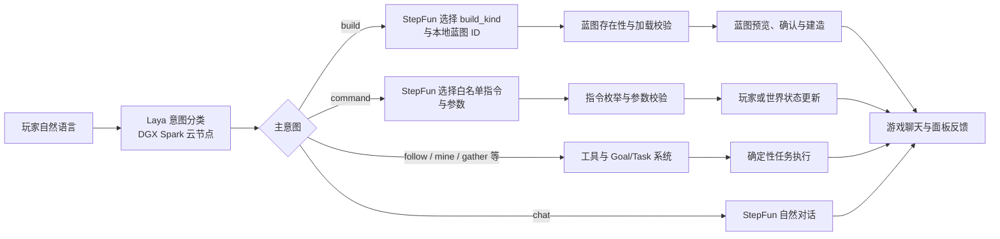

<div align="center">

# AIBot · 会理解任务的 Minecraft 智能体

**DGX Spark 云端 Laya 分类 · StepFun 领域决策 · Fabric 游戏内执行**

从一句自然语言，到一项可检查的游戏行动。

`Minecraft 1.21.3` · `Fabric` · `Java 21` · `Laya` · `StepFun` · `Agent Skills`

</div>

---

> **设计原则**：先判断玩家到底想做什么，再让模型只处理该领域的问题，最后由受约束的游戏逻辑执行。模型负责理解和选择，代码负责校验和落地。

## 项目概览

AIBot 是一个 Minecraft Fabric 模组。它在游戏中生成可交互的 AI 玩家，接收玩家的中文自然语言消息，并将聊天、建造、移动、挖矿、采集和游戏管理指令分开处理。玩家可以说“为我搭建一个日式建筑”“给我房子的图纸”“把我设成生存模式”或“过来”，系统不应把这些不同需求混成同一条通用命令。

项目使用部署在 **DGX Spark 平台提供的云算力节点服务器**上的开源 **Laya** 模型进行第一阶段意图分类。服务端通过对外开放的推理端口调用该模型。分类确定后，**StepFun** 负责领域内的进一步判断：建造时从真实可用的蓝图库中选择建筑类型和蓝图 ID；使用指令时从允许的指令集合中选择操作及参数；其他任务则进入现有工具、Goal 和 Task 执行体系。机器人最终在 Minecraft 世界中行动，并通过游戏聊天与面板反馈结果。

## 为什么采用分层决策

一个通用大模型若同时面对全部聊天、蓝图、指令和运动工具，容易把“谈论建筑”当作“开始建造”，或把“给我图纸”当作“盖一栋房子”。AIBot 将判断拆成三层：

| 层次 | 负责的问题 | 结果 |
|---|---|
| Laya 分类层 | 玩家现在是在聊天、要求建造、要求使用游戏指令，还是要求其他行动？ | 一个主意图，不直接改动世界 |
| 领域决策层 | 在已经确定的领域内，应该选择哪个蓝图、哪条白名单指令或哪项工具？ | StepFun 给出候选动作和必要参数 |
| 执行与校验层 | 结果是否存在、参数是否合法、玩家是否可定位、任务是否完成？ | Java 代码校验并交给 Fabric、Goal/Task 或蓝图系统 |

这样的分工让每次推理只面对相关候选，减少无关信息进入上下文；每个领域可以独立维护规则和测试；模型输出必须经过有限集合与参数校验，不能仅凭一句生成文本直接修改游戏世界。它也让失败位置更清楚：可区分是 Laya 分类失败、StepFun 没有选出有效目标，还是游戏内执行失败。**这些是架构上的预期收益，尚未做延迟、成本或准确率的量化对比。**

## 从对话到行动



| 玩家说的话 | Laya 应判断 | 后续处理 |
|---|---|---|
| “你会建日式房子吗？” | `chat` | 回答问题，不发蓝图也不开始建造 |
| “为我搭建一个日式建筑” | `build` | StepFun 从本地蓝图库选择类型与 ID |
| “给我日式房子的图纸” | `command` | StepFun 选择“发放蓝图”，再选择具体图纸 |
| “把我设置成生存模式” | `command` | StepFun 选择 `gamemode/survival`，校验后执行 |
| “过来跟着我” | `follow` | 进入游戏内移动与跟随任务 |

**`command` 的含义是“请求 AI 使用游戏指令”**，并不指所有祈使句。盖房、挖矿、采集虽然也可以用命令式语气表达，但属于世界内行动。相反，改变玩家模式、天气、时间、死亡不掉落，或向玩家发放蓝图物品，才进入指令分支。

## Agent Skills：把领域知识写成可维护的契约

项目的目标架构是在分类后查询一份总 Skill 索引，再加载相应领域文档，而不是把所有规则永久塞进同一段大提示词：

```text
玩家消息 → Laya 分类 → 总 Skill 索引
                           ├─ 运动 Skill → StepFun 选择运动/跟随动作
                           ├─ 建筑 Skill → StepFun 选择蓝图与建造流程
                           └─ 指令 Skill → StepFun 选择白名单指令与参数
                                      ↓
                              校验、执行、反馈
```

文档契约已整理为：[总 Skill 索引](skills/SKILL.md) · [运动 Skill](skills/movement.md) · [建筑 Skill](skills/building.md) · [指令 Skill](skills/command.md)。总索引只描述路由，领域文档分别写清输入、候选动作、输出约束和失败条件。新增领域时，主要扩充索引与对应文档；改进建筑选择时，也不会意外改变指令规则。

**实现状态**：当前版本的 Laya 分类、StepFun 选择与执行链路已写在 Java 代码的提示词和路由中；这些 Markdown Skill 是下一阶段运行时检索的规范稿，**目前尚未由程序动态读取**。这一点也是后续优化方向：为 Skill 建立版本、加载器、按意图检索与回归测试，再用运行数据比较上下文长度、误路由率和完成率。

## 核心能力与技术实现

| 能力 | 主要实现 |
|---|---|
| 云端分类 | Laya 开源模型部署在 DGX Spark 云算力节点，模组通过 HTTP 推理接口提交对话与分类问题；低置信度或接口失败时不执行任务 |
| StepFun 决策 | 通过 OpenAI 兼容的对话接口，按领域选择蓝图、指令及参数；不让模型直接执行任意服务器命令 |
| 蓝图建造 | 汇集内置及本地 `.litematic` 蓝图；StepFun 从实际候选 ID 中选择，加载校验后交付蓝图物品，玩家可预览、旋转并确认位置 |
| 安全指令 | 只接受游戏模式、死亡不掉落、天气、时间及发放蓝图；非法指令名或参数被拒绝，成功后在聊天中报告 |
| 世界行动 | Fabric 服务端 AI 玩家配合工具注册表、Goal 规划、Task 状态机和寻路/动作逻辑执行挖矿、采集、跟随等任务 |
| 结果可见 | 建造状态、指令结果和任务进度通过游戏聊天或机器人面板反馈给玩家 |

### 一个建造示例

```text
玩家：为我搭建一个日式建筑
Laya：build
StepFun：建筑类型 japanese；选择现有蓝图 japanese_house
程序：核对蓝图 ID、读取结构、交给玩家预览与确认
机器人：我在建造：日式小屋。请放置并确认蓝图。
```

这条路径的关键是 **StepFun 只能从当前蓝图库给出的 ID 中选择**。它不能凭空编造结构文件；蓝图加载失败会向玩家报告，而不是悄悄替换成默认小屋。

## 部署与演示

本地运行需要 Minecraft `1.21.3`、匹配版本的 Fabric Loader / Fabric API，以及 Java `21`。在项目目录执行 `gradlew.bat assemble` 可生成模组 jar；将 jar 放入对应游戏实例的 `mods` 目录并启动游戏。StepFun 凭据应通过运行环境或配置提供，Laya 服务需从游戏主机可达。云端 Laya 节点负责分类推理，Minecraft/Fabric 端负责实际执行；它们可以分别更新和排查。

推荐演示顺序：先让机器人回答一个关于建筑的问题，验证不会误启动；再要求搭建日式建筑，展示 Laya 分类、StepFun 选蓝图与蓝图确认；接着要求切换生存模式，展示指令白名单选择与执行反馈；最后让机器人跟随或采集，展示同一入口如何路由到其他任务。

## 当前边界与下一步

本项目仍在迭代。不同地形上的完整建造、长距离导航和复杂采集需要更多游戏内验证；云端推理的延迟、成本与分类准确率尚无公开基准数据。下一步将接入运行时 Skill 文档检索，记录“分类 → 加载的 Skill → StepFun 选择 → 执行结果”的可追踪链路，并建立含相似表述的测试集，例如“讨论建筑 / 真的建造 / 索要图纸”的区分。

公开提交前还需要检查配置与源码中的凭据，移除任何内嵌密钥并轮换已暴露的密钥；项目说明和演示素材不应包含真实密钥。

---

<div align="center">

**Laya 判断任务边界，Skill 定义领域规则，StepFun 选择行动，Fabric 在世界中完成它。**

</div>
